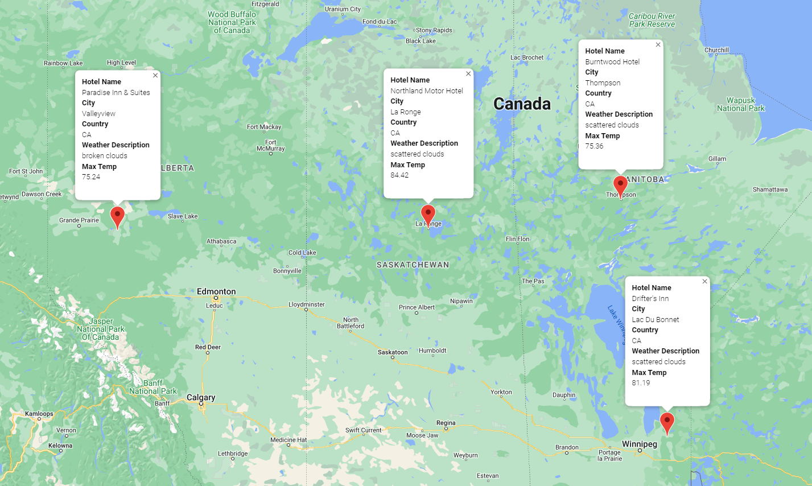

# world_weather_analysis

The purpose of this analysis is to expand upon the weather data to include current descriptions of the weather when planning for trips. In addition, the new app would be able to create an itinerary for the user based on four cities they choose, and then compile that list into a travel route with Google Maps. 

Here is an example of an itinerary:

